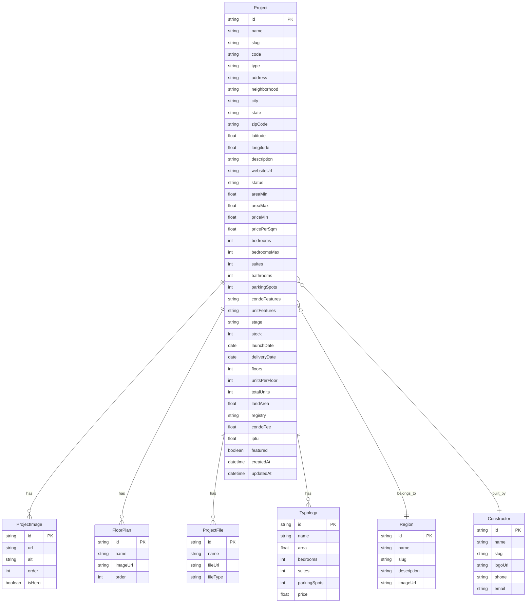

# PLAN: Sistema de Projetos Imobiliários (Estilo Órulo)

Sistema full-stack de gestão de empreendimentos imobiliários integrado ao portfólio existente do corretor. Inclui listagem pública por região, página de detalhe completa (modelo Órulo), painel admin com CRUD, e deploy via Railway.

---

## User Review Required

> [!IMPORTANT]
> **Deploy no Railway** — O projeto inteiro (Next.js + PostgreSQL) será deployado no Railway. Arquivos uploadados serão armazenados no **Railway volume mount** (persistente) em `/uploads`.

> [!WARNING]
> **Impacto no projeto existente:** As mudanças adicionam backend (Prisma + PostgreSQL) ao projeto Next.js existente. A landing page atual **NÃO será afetada**. Os novos routes são adicionais.

---

## Decisões de Arquitetura

| Aspecto            | Decisão                                                   |
| ------------------ | --------------------------------------------------------- |
| Backend            | Next.js API Routes (App Router)                           |
| Banco de Dados     | PostgreSQL via Prisma                                     |
| Upload de Arquivos | Local filesystem (`/uploads`) + Railway Volume            |
| Autenticação Admin | Senha única via `ADMIN_PASSWORD` env var + cookie session |
| Deploy             | Railway (Next.js + PostgreSQL)                            |
| API Style          | REST via Next.js Route Handlers                           |

---

## Modelo de Dados (Baseado no Órulo)



---

## Proposed Changes

### 1. Prisma & Database Setup

#### [NEW] [schema.prisma](file:///g:/PROJETOS/portfolio-profissional-corretor-imoveis/prisma/schema.prisma)

- Definir todos os modelos (Project, Region, Constructor, ProjectImage, FloorPlan, ProjectFile, Typology)
- Configurar provider PostgreSQL com `DATABASE_URL` env var

#### [NEW] [.env.example](file:///g:/PROJETOS/portfolio-profissional-corretor-imoveis/.env.example)

- `DATABASE_URL`, `ADMIN_PASSWORD`, `NEXTAUTH_SECRET`

#### [MODIFY] [package.json](file:///g:/PROJETOS/portfolio-profissional-corretor-imoveis/package.json)

- Adicionar dependências: `prisma`, `@prisma/client`, `bcryptjs`, `sharp`
- Adicionar script: `"prisma:generate"`, `"prisma:push"`, `"postinstall": "prisma generate"`

---

### 2. Prisma Client Singleton

#### [NEW] [lib/prisma.ts](file:///g:/PROJETOS/portfolio-profissional-corretor-imoveis/lib/prisma.ts)

- Singleton do PrismaClient para evitar múltiplas conexões em dev

---

### 3. API Routes (CRUD)

#### [NEW] `app/api/projects/route.ts`

- **GET** — Listar projetos (filtrar por região, status, busca textual)
- **POST** — Criar projeto (protegido por auth)

#### [NEW] `app/api/projects/[id]/route.ts`

- **GET** — Detalhe de um projeto
- **PUT** — Atualizar projeto (protegido)
- **DELETE** — Deletar projeto (protegido)

#### [NEW] `app/api/upload/route.ts`

- **POST** — Upload de imagens e PDFs para `/uploads`
- Gera thumbnail para imagens, retorna URL pública

#### [NEW] `app/api/regions/route.ts`

- **GET** — Listar regiões com contagem de projetos
- **POST** — Criar/editar região (protegido)

#### [NEW] `app/api/constructors/route.ts`

- **GET** — Listar construtoras
- **POST** — Criar/editar construtora (protegido)

#### [NEW] `app/api/auth/login/route.ts`

- **POST** — Login do admin (verifica `ADMIN_PASSWORD`, retorna cookie)

#### [NEW] `app/api/auth/logout/route.ts`

- **POST** — Logout (limpa cookie)

#### [NEW] `lib/auth.ts`

- Helper para verificar cookie de admin nos API routes protegidos
- Middleware de autenticação

---

### 4. Páginas Públicas

#### [NEW] `app/imoveis/page.tsx` — Listagem de Projetos

- Grid de cards (modelo Órulo listing cards)
- Filtro por região (tabs ou sidebar)
- Cada card mostra: imagem, nome, construtora, endereço, área, quartos, suítes, vagas, preço, preço/m², status badge, data entrega
- Badge "DESTAQUE" para projetos marcados como featured
- Paginação

#### [NEW] `app/imoveis/[slug]/page.tsx` — Detalhe do Projeto

Página completa seguindo **exatamente** o modelo Órulo:

- **Hero Gallery** — Imagem principal + thumbnails lateral
- **Header** — Nome, Construtora (com link), badge "Tabela Digital"
- **Endereço** — Endereço completo com zona e cidade
- **Código e Tipo** — Código interno + tipo (Residencial)
- **Características** — Área, quartos, suítes, banheiros, vagas, preço, preço/m²
- **Descrição** — Texto livre
- **Plantas** — Galeria de imagens de plantas com names
- **Características Condominiais** — Tags (piscina, academia, etc.)
- **Características da Unidade** — Tags específicas
- **Tipologias Disponíveis** — Tabela com tipo, área, quartos, suítes, vagas, preço
- **Informações Comerciais** — Dados da construtora
- **Outras Informações** — Estágio, estoque, lançamento, entrega, andares, unidades, terreno, RI, condomínio, IPTU
- **Arquivos** — Download de PDFs
- **Mapa** — Embed com latitude/longitude
- **Botão "Enviar Proposta"** — Link WhatsApp ou form

#### [MODIFY] `components/sections/Regions.tsx`

- Atualizar cards de região para serem Links para `/imoveis?regiao=zona-norte`
- Buscar contagem de projetos por região do banco de dados

---

### 5. Painel Admin

#### [NEW] `app/admin/login/page.tsx`

- Formulário de login simples (senha única)

#### [NEW] `app/admin/page.tsx`

- Dashboard com métricas: total projetos, por região, por status
- Quick actions

#### [NEW] `app/admin/projetos/page.tsx`

- Tabela de projetos com ações (editar, deletar, toggle featured)
- Busca e filtro por status/região

#### [NEW] `app/admin/projetos/novo/page.tsx`

- Formulário completo de criação de projeto
- Upload de múltiplas imagens (galeria)
- Upload de plantas
- Upload de PDFs
- Seleção de região e construtora
- Multi-select para características condominiais
- Campos para tipologias (adicionar/remover linhas)
- Campos para coordenadas (latitude/longitude)

#### [NEW] `app/admin/projetos/[id]/editar/page.tsx`

- Mesmo formulário da criação, preenchido com dados existentes

#### [NEW] `app/admin/regioes/page.tsx`

- CRUD de regiões

#### [NEW] `app/admin/construtoras/page.tsx`

- CRUD de construtoras

#### [NEW] `app/admin/layout.tsx`

- Layout do admin com sidebar de navegação
- Verificação de autenticação (redireciona para login se não autenticado)

#### [NEW] `components/admin/AdminSidebar.tsx`

- Sidebar com links: Dashboard, Projetos, Regiões, Construtoras

---

### 6. Componentes Compartilhados

#### [NEW] `components/projects/ProjectCard.tsx`

- Card de projeto para listagem (imagem, info, preço, badges)

#### [NEW] `components/projects/ProjectGallery.tsx`

- Galeria de imagens com hero + thumbnails (estilo Órulo)

#### [NEW] `components/projects/ProjectFeatures.tsx`

- Grid de características com ícones

#### [NEW] `components/projects/FloorPlanViewer.tsx`

- Visualizador de plantas com modal zoom

#### [NEW] `components/projects/TypologyTable.tsx`

- Tabela de tipologias disponíveis

#### [NEW] `components/projects/ProjectMap.tsx`

- Embed de mapa (Leaflet/OpenStreetMap ou Google Maps)

#### [NEW] `components/admin/ImageUploader.tsx`

- Componente de upload com drag-and-drop, preview, reordenação

#### [NEW] `components/admin/FileUploader.tsx`

- Upload de PDFs com lista e remoção

---

### 7. Railway Deploy Config

#### [NEW] [railway.json](file:///g:/PROJETOS/portfolio-profissional-corretor-imoveis/railway.json)

- Build command: `npx prisma generate && npm run build`
- Start command: `npm run start`
- Volume mount para `/uploads`

#### [NEW] [Dockerfile](file:///g:/PROJETOS/portfolio-profissional-corretor-imoveis/Dockerfile)

- Node.js 20 Alpine
- Prisma generate + Next.js build
- Volume mount para uploads persistentes

#### [MODIFY] [next.config.ts](file:///g:/PROJETOS/portfolio-profissional-corretor-imoveis/next.config.ts)

- Configurar `output: 'standalone'` para deploy
- Configurar rewrites para servir `/uploads` como static files

---

## Fases de Implementação

### Fase A: Infraestrutura (Prisma + Auth + Upload)

1. Instalar dependências (prisma, @prisma/client, sharp, bcryptjs)
2. Criar `schema.prisma` com todos os modelos
3. Criar `lib/prisma.ts` (singleton)
4. Criar `lib/auth.ts` (admin auth helpers)
5. Criar API route de login/logout
6. Criar API route de upload de arquivos
7. Configurar `.env` com `DATABASE_URL` e `ADMIN_PASSWORD`
8. Rodar `prisma db push` para criar as tabelas

### Fase B: API Routes (CRUD)

1. API de projetos (GET list, GET detail, POST, PUT, DELETE)
2. API de regiões (GET, POST)
3. API de construtoras (GET, POST)
4. Seed com dados de exemplo

### Fase C: Painel Admin

1. Layout do admin (sidebar + auth check)
2. Login page
3. Dashboard
4. CRUD de projetos (form com upload)
5. CRUD de regiões
6. CRUD de construtoras

### Fase D: Páginas Públicas

1. Listagem de projetos (`/imoveis`)
2. Detalhe do projeto (`/imoveis/[slug]`)
3. Atualizar Regions section na landing page

### Fase E: Deploy + Polish

1. Configurar Railway (PostgreSQL + Next.js + Volume)
2. Configurar variáveis de ambiente no Railway
3. Seed de dados no Railway
4. Testar upload de arquivos no Railway

---

## Verification Plan

### Testes Automatizados (pós-implementação)

```bash
# Verificar se Prisma gera o client sem erros
npx prisma generate

# Verificar build sem erros TypeScript
npm run build

# Testar API de login (cURL)
curl -X POST http://localhost:3000/api/auth/login \
  -H "Content-Type: application/json" \
  -d '{"password":"test123"}'

# Testar criação de projeto (cURL, autenticado)
curl -X POST http://localhost:3000/api/projects \
  -H "Content-Type: application/json" \
  -H "Cookie: admin-token=..." \
  -d '{"name":"Test","regionId":"...","constructorId":"..."}'
```

### Verificação Manual (com o usuário)

1. **Admin Login:** Abrir `/admin/login`, digitar a senha, verificar redirect para dashboard
2. **Criar Projeto:** No admin, criar um projeto com todos os campos, upload de 3+ imagens, 1 planta, 1 PDF
3. **Listagem:** Abrir `/imoveis`, verificar se o projeto aparece no card
4. **Filtro por Região:** Clicar numa região e verificar filtragem
5. **Detalhe:** Clicar no card, verificar se todas as seções do Órulo aparecem
6. **Download PDF:** Clicar no arquivo PDF e verificar download
7. **Mapa:** Verificar se o mapa renderiza com o pin correto
8. **Mobile:** Testar responsividade em tela de celular
9. **Landing Page:** Verificar que a landing page existente NÃO foi afetada

---

## Estimativa de Arquivos

| Categoria        | Arquivos Novos | Arquivos Modificados |
| ---------------- | -------------- | -------------------- |
| Prisma/DB        | 3              | 1 (package.json)     |
| API Routes       | 8              | 0                    |
| Páginas Públicas | 2              | 1 (Regions.tsx)      |
| Páginas Admin    | 7              | 0                    |
| Componentes      | 10             | 0                    |
| Deploy Config    | 2-3            | 1 (next.config.ts)   |
| **Total**        | **~33**        | **~3**               |
